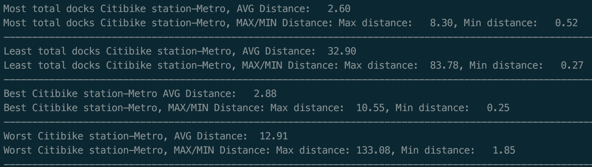

# Python For Data Analysis

After working with large data sets at my previous job using excel, I wanted to explore Data Analysis further using a programming language. I chose Python as my language for independent studies and over the course of a week learned Python while running small analysis to test my hypothesis that the most popular Citibike stations would be located further from a metro station.

# Data and API's Used
 Citibike API and Google BigQuery were used to pull information on Citibike stations.
 * The Citibike API was used to find the location of the top 20 citibike stations with the most bikes and the bottom 20 Citibike locations with the least bikes. View the [Citibike api](https://www.citibikenyc.com/system-data)
 * Google BigQuery was use to find the top 20 most popular Citibike locations for subscribers and the bottom 20 least popular Citibike locations for subscribers. View Citibike data with [Google BigQuery](https://cloud.google.com/bigquery/public-data/nyc-citi-bike)

Data of latitude and longitude coordinates for all Metro Station locations in NYC was found posted as a CSV file on the betaNYC website.
* View on [betaNYC](http://data.beta.nyc/dataset/subway-station-entrances/resource/65ce7334-6323-495c-83a0-ec687897a93a)

# Technology
Python3 was used for this small program that can be run in the terminal. If you would like to run the scripts on your own computer you will need Python 3.6.

To run this program:
* Clone this repository: `git clone https://github.com/davellaj/citibike_data_analysis.git`
* run the command: `python3 main.py`

Next steps will include:
- Visualizing data results with [Matplot](http://matplotlib.org/)
- Graphing Citibike API's real time station data

# Slides

These slides were used for a short presentation to my Thinkful BootCamp Cohort. It includes example Python code and comparisons to Javascript.

View the [slides online](https://docs.google.com/presentation/d/11tMqiyHBRmkBqYNCFx9FkEY0rrT9Z3PJrQ3nVyGzIho/edit?usp=sharing)
